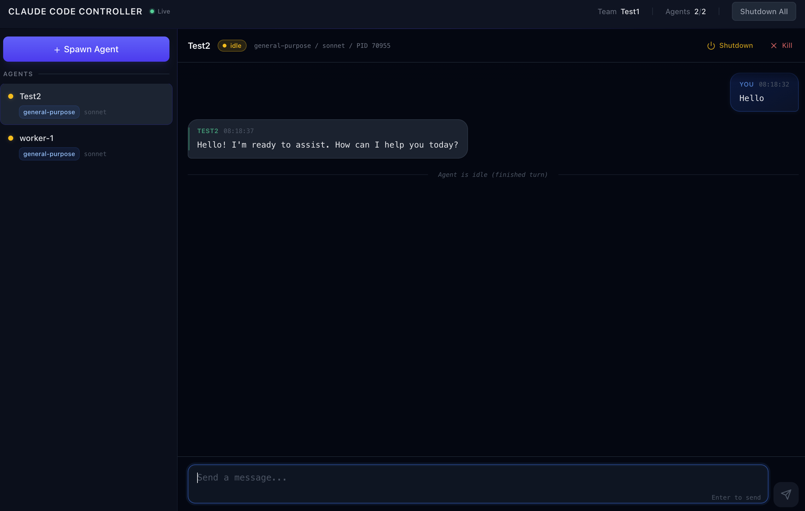

# claude-code-controller

**Spawn, orchestrate, and control Claude Code agents from your own code.**

[](https://www.npmjs.com/package/claude-code-controller)
[](LICENSE)
[](https://nodejs.org)



No Agent SDK. No `-p` mode. Full programmatic control over real Claude Code instances through the internal filesystem-based teams protocol.

---

## Why?

Claude Code is powerful interactively, but there's no clean way to control it programmatically for automation. The Agent SDK is a separate thing. The `-p` flag is limited to single prompts.

This library reverse-engineers Claude Code's internal team communication protocol (filesystem-based inboxes, team configs, task files) and wraps it in a clean TypeScript API. You get:

- **Real Claude Code agents** with all their tools (Bash, Read, Write, Glob, Grep...)
- **Multi-agent orchestration** with message passing and task assignment
- **Full event system** for plan approvals, permission requests, shutdowns
- **Custom environment routing** to use any API provider

---

## Install

```bash
npm install claude-code-controller
```

> **Prerequisites:** Claude Code CLI v2.1.34+ installed

---

## Quick Start

```typescript
import { ClaudeCodeController } from "claude-code-controller";

const ctrl = new ClaudeCodeController({ teamName: "my-project" });
await ctrl.init();

const agent = await ctrl.spawnAgent({
  name: "coder",
  type: "general-purpose",
  model: "sonnet",
});

// Wait for the agent to boot up
await new Promise((r) => setTimeout(r, 10_000));

// Ask something and get the answer back
const answer = await agent.ask(
  "Read package.json and tell me the project name. Reply using SendMessage.",
  { timeout: 60_000 }
);
console.log(answer);

await ctrl.shutdown();
```

---

## Real-World Examples

### Multi-Agent Code Review

```typescript
const ctrl = new ClaudeCodeController({ teamName: "review" });
await ctrl.init();

// Spawn specialized reviewers in parallel
const [security, perf, style] = await Promise.all([
  ctrl.spawnAgent({ name: "security", type: "general-purpose", model: "opus" }),
  ctrl.spawnAgent({ name: "perf", type: "general-purpose", model: "sonnet" }),
  ctrl.spawnAgent({ name: "style", type: "general-purpose", model: "haiku" }),
]);

await new Promise((r) => setTimeout(r, 12_000));

// Give each reviewer a different focus
const reviews = await Promise.all([
  security.ask("Review src/ for security vulnerabilities. Reply with SendMessage."),
  perf.ask("Review src/ for performance issues. Reply with SendMessage."),
  style.ask("Review src/ for code style issues. Reply with SendMessage."),
]);

console.log("Security:", reviews[0]);
console.log("Performance:", reviews[1]);
console.log("Style:", reviews[2]);

await ctrl.shutdown();
```

### Task-Based Workflow

```typescript
const ctrl = new ClaudeCodeController({ teamName: "tasks" });
await ctrl.init();

const worker = await ctrl.spawnAgent({ name: "worker", model: "sonnet" });
await new Promise((r) => setTimeout(r, 10_000));

// Create and assign a task
const taskId = await ctrl.createTask({
  subject: "Add input validation",
  description: "Add zod validation to all API route handlers in src/routes/",
  owner: "worker",
});

// Wait for the agent to complete it
const result = await ctrl.waitForTask(taskId, 120_000);
console.log(`Task ${result.status}: ${result.subject}`);

await ctrl.shutdown();
```

### Custom API Provider

Route agents through any OpenAI-compatible endpoint:

```typescript
const ctrl = new ClaudeCodeController({
  teamName: "custom",
  env: {
    ANTHROPIC_BASE_URL: "https://your-proxy.example.com/api/anthropic",
    ANTHROPIC_AUTH_TOKEN: process.env.MY_API_KEY!,
  },
});
```

Per-agent overrides take precedence:

```typescript
const agent = await ctrl.spawnAgent({
  name: "worker",
  env: { ANTHROPIC_AUTH_TOKEN: "different-key-for-this-agent" },
});
```

### Event-Driven Control

```typescript
const ctrl = new ClaudeCodeController({ teamName: "events" });
await ctrl.init();

// Auto-approve all plan requests
ctrl.on("plan:approval_request", (agent, msg) => {
  ctrl.sendPlanApproval(agent, msg.requestId, true);
});

// Auto-approve safe tool use, reject dangerous ones
ctrl.on("permission:request", (agent, msg) => {
  const safe = ["Read", "Glob", "Grep"].includes(msg.toolName);
  ctrl.sendPermissionResponse(agent, msg.requestId, safe);
});

// React to agent messages
ctrl.on("message", (agent, msg) => {
  console.log(`[${agent}] ${msg.text}`);
});

// Track lifecycle
ctrl.on("agent:spawned", (name, pid) => console.log(`${name} started (${pid})`));
ctrl.on("agent:exited", (name, code) => console.log(`${name} exited (${code})`));
```

---

## API Reference

### `ClaudeCodeController`

```typescript
const ctrl = new ClaudeCodeController({
  teamName?: string,                // default: auto-generated
  cwd?: string,                     // working directory for agents
  claudeBinary?: string,            // path to claude CLI (default: "claude")
  env?: Record<string, string>,     // default env vars for all agents
  logLevel?: "debug" | "info" | "warn" | "error" | "silent",
});
```

#### Lifecycle

| Method | Description |
|---|---|
| `ctrl.init()` | Initialize controller. Must call first. |
| `ctrl.shutdown()` | Graceful shutdown: request stop, wait, kill stragglers, clean up files. |

#### Agents

| Method | Returns | Description |
|---|---|---|
| `ctrl.spawnAgent(opts)` | `AgentHandle` | Spawn a Claude Code agent |
| `ctrl.isAgentRunning(name)` | `boolean` | Check if agent process is alive |
| `ctrl.killAgent(name)` | `void` | Force-kill an agent |

`SpawnAgentOptions`:

```typescript
{
  name: string,
  type?: "general-purpose" | "Bash" | "Explore" | "Plan" | string,
  model?: "sonnet" | "opus" | "haiku" | string,
  cwd?: string,
  permissions?: string[],    // e.g. ["Bash", "Read", "Write"]
  env?: Record<string, string>,
}
```

#### Messaging

| Method | Returns | Description |
|---|---|---|
| `ctrl.send(agent, message, summary?)` | `void` | Send message to an agent |
| `ctrl.broadcast(message, summary?)` | `void` | Send to all agents |
| `ctrl.receive(agent, opts?)` | `InboxMessage[]` | Wait for messages from agent |
| `ctrl.receiveAny(opts?)` | `InboxMessage` | Wait for message from any agent |

#### Tasks

| Method | Returns | Description |
|---|---|---|
| `ctrl.createTask({ subject, description, owner? })` | `string` (task ID) | Create a task, optionally assign it |
| `ctrl.assignTask(taskId, agentName)` | `void` | Assign task to agent |
| `ctrl.waitForTask(taskId, timeout?)` | `TaskFile` | Block until task completes |

#### Protocol

| Method | Description |
|---|---|
| `ctrl.sendPlanApproval(agent, requestId, approve, feedback?)` | Respond to plan approval request |
| `ctrl.sendPermissionResponse(agent, requestId, approve)` | Respond to permission request |
| `ctrl.sendShutdownRequest(agent)` | Request graceful shutdown |

### `AgentHandle`

Convenience wrapper returned by `spawnAgent()`.

```typescript
await agent.send(message, summary?)   // Send a message
await agent.receive(opts?)            // Wait for response text
await agent.ask(question, opts?)      // Send + receive in one call
await agent.shutdown()                // Request graceful shutdown
await agent.kill()                    // Force kill
agent.isRunning                       // Check if alive (getter)
agent.name                            // Agent name
agent.pid                             // Process PID

// Async iterator for streaming events
for await (const msg of agent.events()) {
  console.log(msg.text);
}
```

### Events

```typescript
ctrl.on("message",              (agentName, message) => { ... });
ctrl.on("idle",                 (agentName) => { ... });
ctrl.on("agent:spawned",        (agentName, pid) => { ... });
ctrl.on("agent:exited",         (agentName, code) => { ... });
ctrl.on("task:completed",       (task) => { ... });
ctrl.on("shutdown:approved",    (agentName, message) => { ... });
ctrl.on("plan:approval_request",(agentName, message) => { ... });
ctrl.on("permission:request",   (agentName, message) => { ... });
ctrl.on("error",                (error) => { ... });
```

---

## How It Works

Claude Code has an internal "teammate" system that communicates through the filesystem:

| Component | Path | Purpose |
|---|---|---|
| Teams | `~/.claude/teams/{name}/config.json` | Team membership & config |
| Inboxes | `~/.claude/teams/{name}/inboxes/{agent}.json` | Message passing |
| Tasks | `~/.claude/tasks/{name}/{id}.json` | Task tracking |

This library creates those files, spawns real Claude Code CLI processes via PTY, and communicates with them through the inbox protocol. Agents think they're in a normal team and respond naturally.

```
ClaudeCodeController
├── TeamManager        — team config CRUD
├── TaskManager        — task lifecycle management
├── ProcessManager     — PTY-based process spawning
├── InboxPoller        — polls controller inbox for agent messages
└── AgentHandle        — per-agent convenience wrapper
```

---

## Web UI

A built-in web dashboard lets you spawn agents, see their messages in real-time, and handle plan/permission approvals — all from your browser.

```bash
cd web
bun install
```

**Development** (two terminals):

```bash
bun run dev          # backend on :3456
bun run dev:vite     # frontend on :5174 (proxies API to :3456)
```

Open http://localhost:5174

**Production:**

```bash
bun run build        # build frontend
bun run start        # serve everything on :3456
```

Open http://localhost:3456

The UI provides:
- **Session management** — initialize/shutdown the controller
- **Agent spawning** — configure name, type, model, and environment variables
- **Live message feed** — real-time messages via WebSocket
- **Approval prompts** — interactive plan and permission approval banners
- **Agent controls** — shutdown or kill agents individually

---

## Development

```bash
bun install          # install deps
bun test             # run tests (89 tests)
bun run typecheck    # type check
bun run build        # build for distribution
```

---

## Roadmap

- **Tmux session per agent** — Spawn each agent in its own tmux pane so you can attach to it (`tmux attach -t <agent>`) and watch it work in real time: tool calls, file edits, reasoning — like watching someone use Claude Code interactively
- **Task management in the UI** — Create, assign, and track tasks from the web dashboard
- **Agent-to-agent messaging** — Let agents communicate directly with each other
- **Persistent sessions** — Resume a team session after server restart

---

## License

MIT
